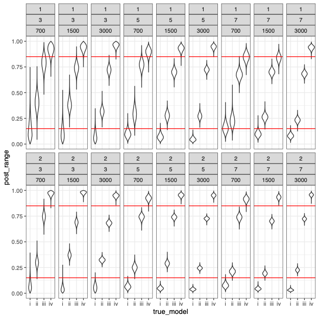
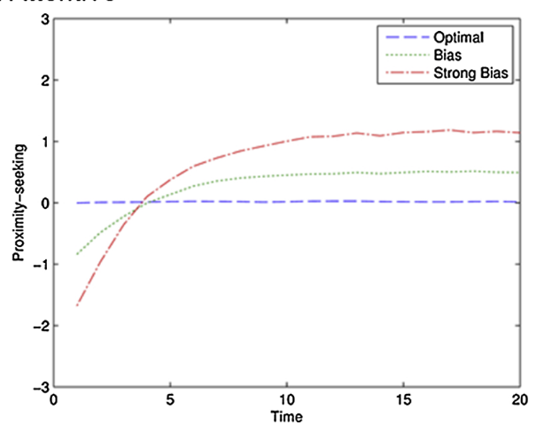
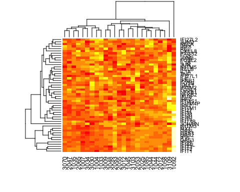

# Justin Chumbley Ph.D

[[bio](index.md)]
[[projects](more_figures.md)]
[[cv](http://chumbleycode.github.io/chumbleycode.github.io/docs/cv.pdf)]
[[publications](https://scholar.google.com/citations?hl=en&user=YbbXlwIAAAAJ)]
[[github](https://github.com/chumbleycode/)] 
[[linkedin](https://www.linkedin.com/in/chumbleycode)] 

<table class="fixed">
    <col width="200px" />
    <col width="350px" /> 
    <tr>
        <td>  </td>
        <td> I am an applied statistician with a broad background in behavioral and biological sciences:   
            &#8594; Check out my CV <a href="http://chumbleycode.github.io/chumbleycode.github.io/docs/cv.pdf"> here</a>.   
             I develop experiments and the statistical tools to analyze them. I help my collaborators clarify, simplify and solve challenging interdisciplinary problems:   
            &#8594; Learn more about my current projects <a href="index.html"> back.</a>
            </td>
    </tr>
</table>

  
  
Click the figures to learn more about some of my recent and working projects!  

|   	|   	|   	|
|---	|---	|---	|
| --- Current work in Bayesian parameter ranking! --- |  --- Bayesian life course models in developmental epidemiology!  --- |   --- Using behavioral games to study personality!  --- |
|   | |   | 
| --- An R package for Differential binding of DNA transcription motifs! --- |  Computational psychiatry of social attachment! ---| --- Sampling strategies for studying peer victimization! --- |
|    | |   | 
| --- A primer on causal mediation for biologists! --- | --- Pilot: parental treatment effects gene expression I! --- | --- Pilot: parental treatment effects gene expression II! ---  |
|  | | | 

