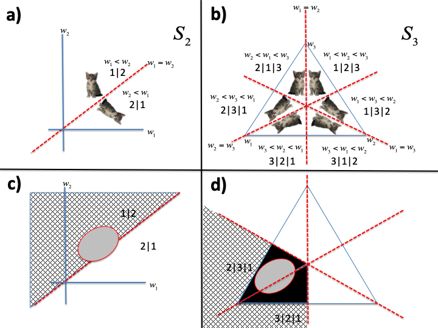
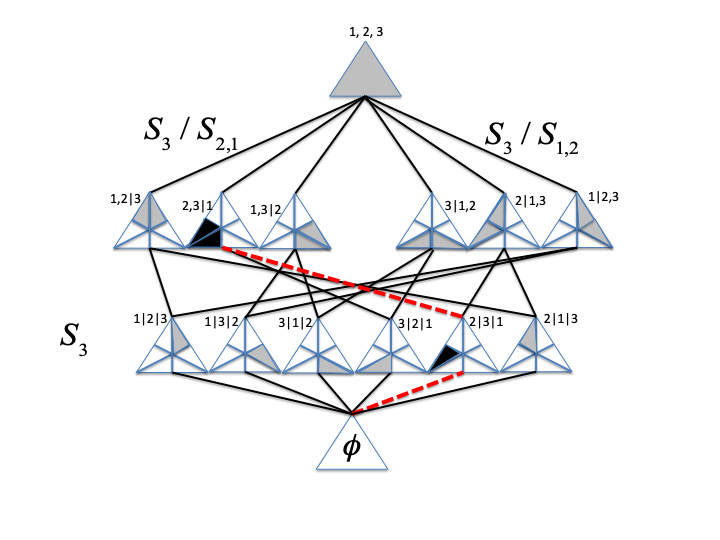
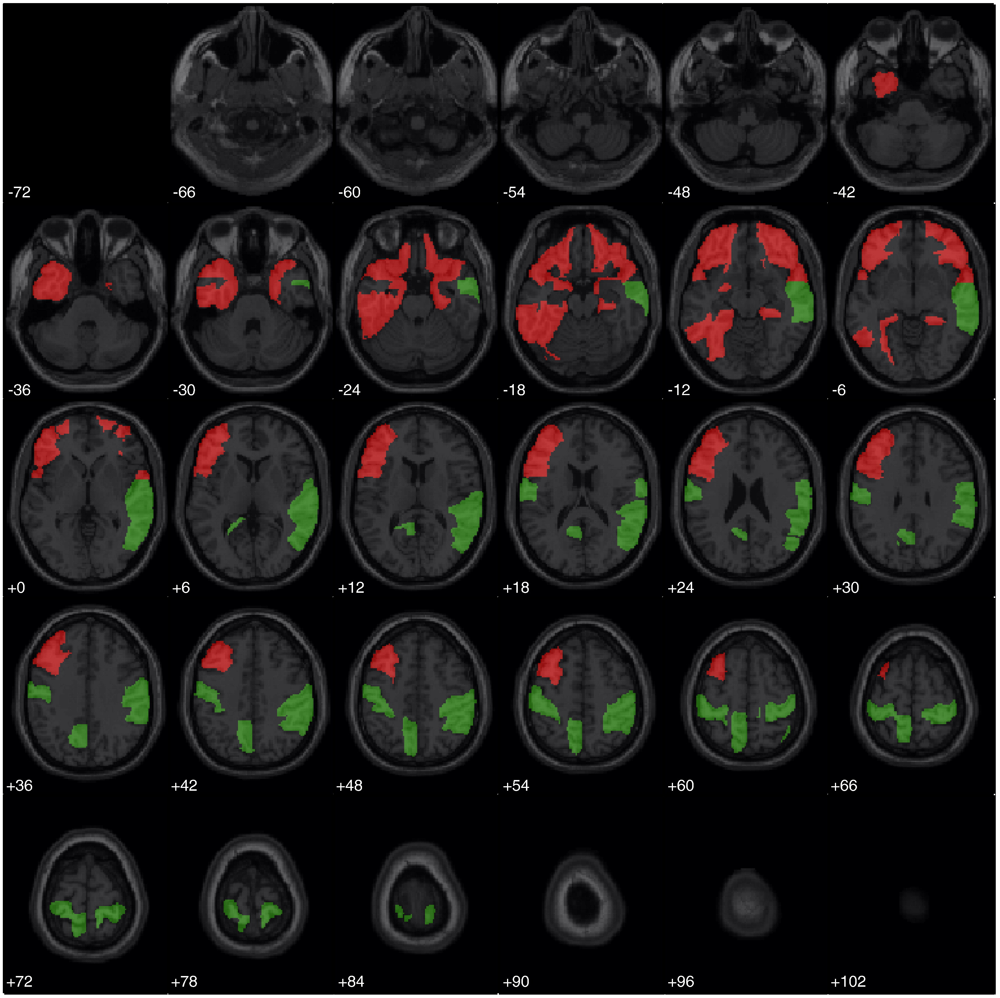
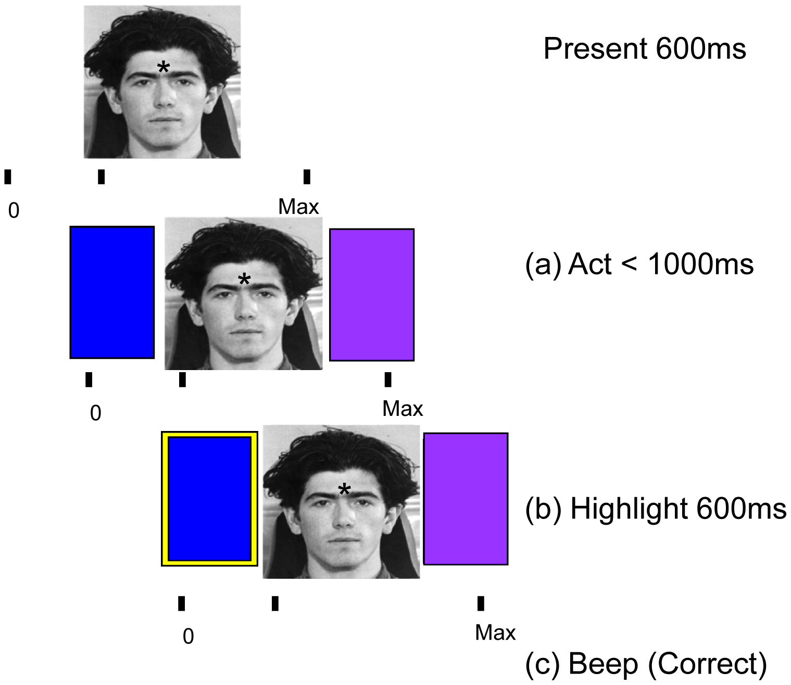
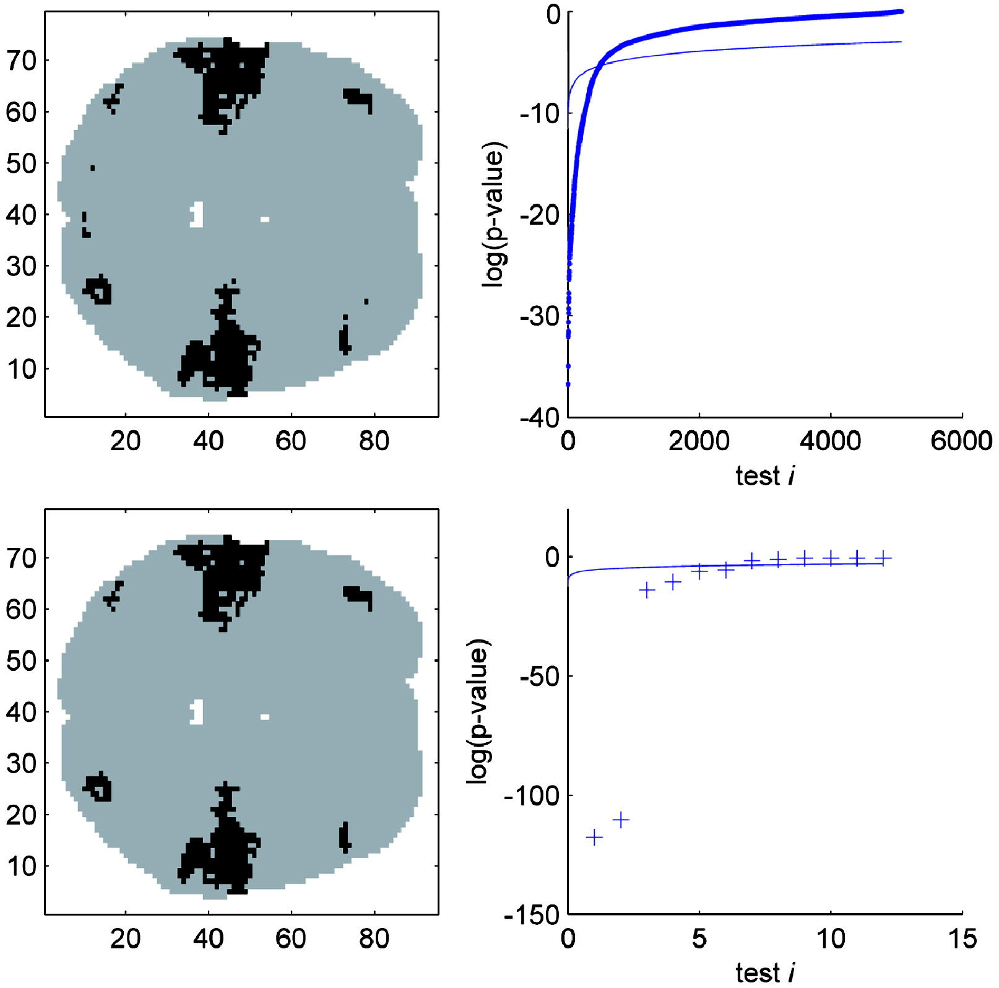

<!--
# Justin Chumbley

[[cv](http://chumbleycode.github.io/chumbleycode.github.io/docs/cv.pdf)] 
[[linkedin](https://www.linkedin.com/in/chumbleycode)] 
[[github](https://github.com/chumbleycode/)] 
[[projects](projects.md)]
[[publications](https://scholar.google.com/citations?hl=en&user=YbbXlwIAAAAJ)]

    

I am an applied statistician with a broad background in behavioral and biological sciences [[more](http://chumbleycode.github.io/chumbleycode.github.io/docs/cv.pdf)].   
I try to help people clarify and solve tricky and sometimes vague interdisciplinary problems.  
Click on the figures above to learn more about recent work in Bayesian parameter ranking!  

     

Learn more about my work in frequentist and Bayesian neuroimaging!   

    

Text-->

 
# Justin Chumbley

[[cv](http://chumbleycode.github.io/chumbleycode.github.io/docs/cv.pdf)] 
[[linkedin](https://www.linkedin.com/in/chumbleycode)] 
[[github](https://github.com/chumbleycode/)] 
[[projects](projects.md)]
[[publications](https://scholar.google.com/citations?hl=en&user=YbbXlwIAAAAJ)]

 

I am an applied statistician with a broad background in behavioral and biological sciences [[more](http://chumbleycode.github.io/chumbleycode.github.io/docs/cv.pdf)].   
I try to help people clarify and solve complicated and sometimes vague interdisciplinary problems.  
Click on the figures above to learn more about recent work in Bayesian parameter ranking!  

 
|   	|   	|
|---	|---	|
|   	| recent work in Bayesian parameter ranking!  	|
|   	| Multiple comparisons and spatial overfitting!  	|
|  	| Spatial inference for fMRI!  	|
|    	|  Bayesian models of neuronal learning. 	|
|   	|   	| 

[more...](more_figures.md)

 
