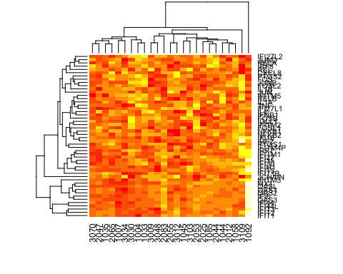

# Justin Chumbley Ph.D

[[bio](index.md)]
[[cv](http://chumbleycode.github.io/chumbleycode.github.io/docs/cv.pdf)]
[[projects](proj/projects.md)]
[[publications](https://scholar.google.com/citations?hl=en&user=YbbXlwIAAAAJ)]
[[github](https://github.com/chumbleycode/)] 
[[linkedin](https://www.linkedin.com/in/chumbleycode)] 

<table class="fixed">
    <col width="200px" />
    <col width="200px" /> 
    <tr>
        <td>  </td>
        <td> I am an applied statistician with a broad background in behavioral and biological sciences (check out my CV <a href="http://chumbleycode.github.io/chumbleycode.github.io/docs/cv.pdf"> here</a>). I help my collaborators clarify, simplify and solve tricky interdisciplinary problems (read more about my current projects <a href="index.html"> back</a>).
            </td>
    </tr>
</table>

  
  
Click the figures to learn more about some of my projects!  
 
|   	|   	|
|---	|---	|
|   	| Current work in Bayesian parameter ranking!  	|
| | Bayesian life course models in developmental epidemiology! |
| | Using behavioral games to study personality! |
| | Computational psychiatry of social attachment! |
|   	| Multiple comparisons and spatial overfitting!  	|
|  	| Spatial inference for fMRI!  	|
|  |  Bayesian models of neuronal learning! |
|   | A sampling strategy for studying bully victims. |
| | A primer on causal mediation for biologists! |
| | Pilot project on the effects of parental treatment on gene expression I. |
| | Pilot project on the effects of parental treatment on gene expression II.  |
|    | An R package for Differential binding of DNA transcription motifs!	| 
 
